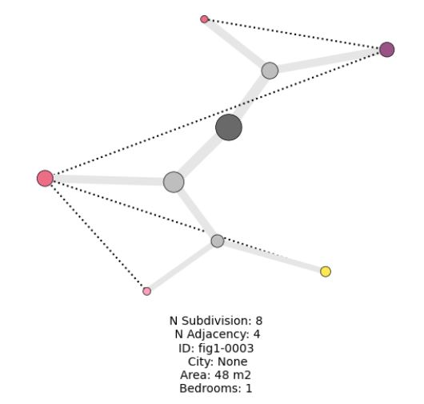

# Hypergraph Research Geometry Library and API

Full source code and documentation of ongoing architectural geometry research on automated floor plan analysis and generation. The repository features a C# source code of the research geometry library, a (mostly) 2d geometry library implementing the hypergraph representation. 

This package is maintained by [@ramonweber](https://github.com/ramonweber) with contributions from [@szvsw](https://github.com/szvsw) for the web api implementation.

Contact: reweber@mit.edu


*Figure 1: Illustration of the hypergraph representation and environmental analysis*

# Contents

- [Introduction](#hypergraph-research-geometry-library-and-api)
- [Overview](#overview)
- [How to use this repository](#how-to-use-this-repository)
- [Requirements](#requirements)
- [Sample files and demos](#sample-files-and-integration-into-cad)
- [Web API](#floorplanner-api)

# Overview

The full research geometry library RGeoLib that implements various geometric algorithms and translates geometry from the CAD package Rhino3d for design automation and analysis of buildings. The geometry library implements data structures for vectors, meshes, lines, hypergraphs, apartments. This repository section gives an overview of the library, the required software packages, as well as the accompanying sample scripts.

# How to use this repository

The repository features 4 different ways to access the files 
1. Full source code for your own experimentation via the `/ResearchGeometryLibrary/RGeoLib`
2. Visualization tools for representing floorplans as hypergraphs `/notebooks/visualize_hypergraph.ipynb`
3. Sample files for integration into the Rhino3d and Grasshopper CAD environment `/samples`
4. API integration of basic FLoorPlanner functionality via the web as `/FloorPlanTools`

# Requirements

The package development version is tested on a Windows operating system. While the .Net geometry library, as well as the hypergraph visualizer are platform independent, the sample files require a Windows operating system as well as the following software:

- CAD environment [Rhino3d](https://rhino3d.com/ "rhino") (version7) 
- Environmental simulation [Climate Studio](https://www.solemma.com/climatestudio "cs") (version 2.0.8742.29048)
- Python `3.10.12` for the hypergraph visualization

# Hypergraph Visualizer

Open the notebook `notebooks/visualize_hypergraph.ipynb` to visualize apartment floor plans as sample hypergraphs. A json file with geometry data can be found in `samples/sample_hypergraphs.ipynb`

|  |  |
|:--:|:--:|  # This centers the images in their respective columns
| Original architectural floor plan | Resulting hypergraph from programmatic zones |

# Sample files and demos

The sample files require the CAD software. The content of the folder `/samples/_requiredDLLs` should be unblocked and placed on accessible on the local hard drive in the folder `C:/geolib`. In Rhino3d the `.3dm` file has to be loaded. Then the Grasshopper environment inside Rhino3d can be started and the corresponding `.gh` file loaded with the same name.

The three sample scripts showcase how the hypergraph implementation can be used to create artificially generated floor plans from a library of input floor plans. In the first script the `/samples/Hypergraph Reference Script 0 Load Hypergraph.3dm` a `.json` file with example hypergraphs can be loaded and visualized in the CAD environment. In the `/samples/Hypergraph Reference Script 1 Transfer Layout via Hypergraph.3dm` six input floor plans can be applied to a target apartment boundary geometry. The boundary geometry is defined as a boundary polyline (a series of closed lines) and with lines defining circulation and façade access. The second set of sample files shows the environmental analysis workflow connected with the hypergraph generated floor plan layouts `/samples/Hypergraph Reference Script 2 Environmental Simulation.3dm`. Both daylight simulation and energy simulation of different building envelopes can be run in parallel and their output evaluated.


*Sample Script 0: Screenshot from inside the CAD environment Rhino3d and the node based scripting platform Grasshopper where a json file is used to load a floorplan from a hypergraph format.*


*Sample Script 1: Screenshot from inside the CAD environment Rhino3d and the node based scripting platform Grasshopper where a floor plan from a custom library can be selected to be applied to a target geometry. The research geometry implementation The CAD file defines boundary geometry, circulation access and façade as a series of lines.*


*Sample Script 2: Screenshot from inside the CAD environment Rhino3d and the node based scripting platform Grasshopper where a floor plan is analyzed in terms of space, energy use and daylight.*


# FloorPlanner API

Scaffold for integrating the hypergraph functionality and floor plan analysis library into a web API. Contributed by  

## Consuming the API

### Option 1: Running the API Locally

1. Install docker.
1. Clone the Repo
1. Place all DLLs in the `dlls/lib` or `dlls/reqs` folder.  Make sure they are unblocked.
2. Copy `.env.example` to `.env`
3. Set `API_ROOT_URL` to `http://localhost:8000`
3. Run `docker compose up` from the repository root
4. Open the notebook `notebooks/demo.ipynb`
5. Run all.

### Option 2: Using the Deployed API

1. Clone the Repo
1. Make a conda env: `conda create -n floorplans python=3.9`
1. Install reqs: `pip install -r requirements.txt -r requirements-dev.txt`
2. Copy `.env.example` to `.env`
3. Update the value for `API_ROOT_URL` to the web URL (inquire for details)
4. Open the notebook `notebooks/demo.ipynb`
5. Run all.


## Dev Setup

### Option 1: Local Environment

#### Setup

Create a conda environment:

```
conda create -n floorplan python=3.9`
```

Then install dependencies:

```
pip install -r requirements.txt -r requirements-dev.txt
```

#### Run the API

To run the API, launch the following command from a terminal in the root directory of the repository:

```
uvicorn api.main:api
```

You can optionally append `--reload` to enable hot-reloading as you edit the backend.

Then, visit `http://localhost:8000` in your browser.  You should see `{"message": "Hello world!"}` appear.

Next, visit `http://localhost:8000/docs` to see the auto-documentation page and a list of the various endpoints.  

### Option 2: Docker Compose

Install docker.

Then, from the root of the repo, run `docker compose up`.

Then visit `http://localhost:8000/docs` in a browser to see the autodocs page.


