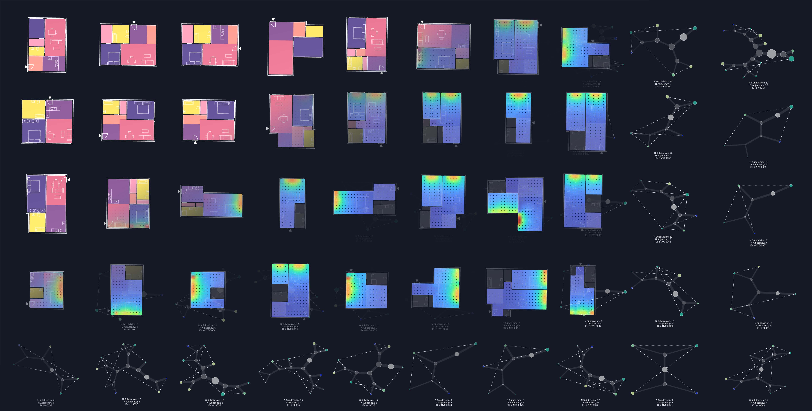

# Hypergraph Research Geometry Library and API

Full source code and documentation of ongoing architectural geometry research. The repository features a C# source code of the research geometry library, a (mostly) 2d geometry library implementing the hypergraph representation. 

This is a work in progress! 
contact: reweber@mit.edu


*Figure 1: Illustration of the hypergraph representation and environmental analysis*

## How to use this repository

The repository features 3 different ways to access the files 
1. Full source code for your own experimentation via the `/ResearchGeometryLibrary/RGeoLib`
2. Sample files for integration into the Rhino3d and Grasshopper CAD environment `/samples`
3. API integration of basic FLoorPlanner functionality via the web as `/FloorPlanTools`

# Sample files and integration into CAD

The sample files require the CAD software [Rhino3d](https://rhino3d.com/ "Optional title") (version7). The content of the folder `/samples/_requiredDLLs` should be unblocked and placed on accessible on the local hard drive in the folder `C:\geolib`

# FloorPlanner API

Scaffold for integrating the hypergraph functionality and floor plan analysis library into a web API. Contributed by @szvsw.

## Consuming the API

### Option 1: Running the API Locally

1. Install docker.
1. Clone the Repo
1. Place all DLLs in the `dlls/lib` or `dlls/reqs` folder.  Make sure they are unblocked.
2. Copy `.env.example` to `.env`
3. Set `API_ROOT_URL` to `http://localhost:8000`
3. Run `docker compose up` from the repository root
4. Open the notebook `notebooks/demo.ipynb`
5. Run all.

### Option 2: Using the Deployed API

1. Clone the Repo
1. Make a conda env: `conda create -n floorplans python=3.9`
1. Install reqs: `pip install -r requirements.txt -r requirements-dev.txt`
2. Copy `.env.example` to `.env`
3. Update the value for `API_ROOT_URL` to the web URL (inquire for details)
4. Open the notebook `notebooks/demo.ipynb`
5. Run all.


## Dev Setup

### Option 1: Local Environment

#### Setup

Create a conda environment:

```
conda create -n floorplan python=3.9`
```

Then install dependencies:

```
pip install -r requirements.txt -r requirements-dev.txt
```

#### Run the API

To run the API, launch the following command from a terminal in the root directory of the repository:

```
uvicorn api.main:api
```

You can optionally append `--reload` to enable hot-reloading as you edit the backend.

Then, visit `http://localhost:8000` in your browser.  You should see `{"message": "Hello world!"}` appear.

Next, visit `http://localhost:8000/docs` to see the auto-documentation page and a list of the various endpoints.  

### Option 2: Docker Compose

Install docker.

Then, from the root of the repo, run `docker compose up`.

Then visit `http://localhost:8000/docs` in a browser to see the autodocs page.


